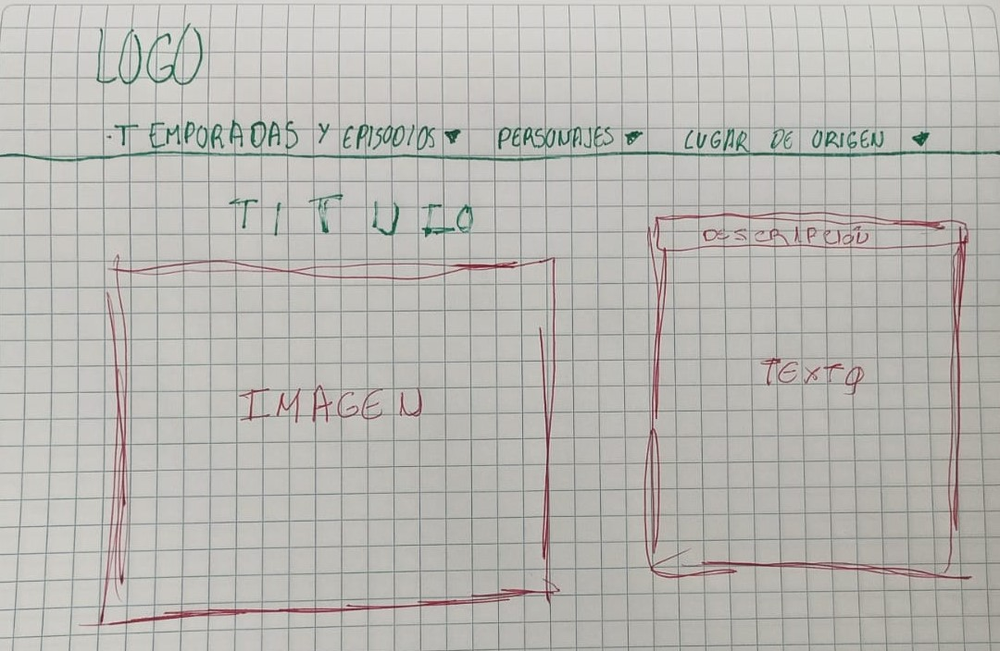
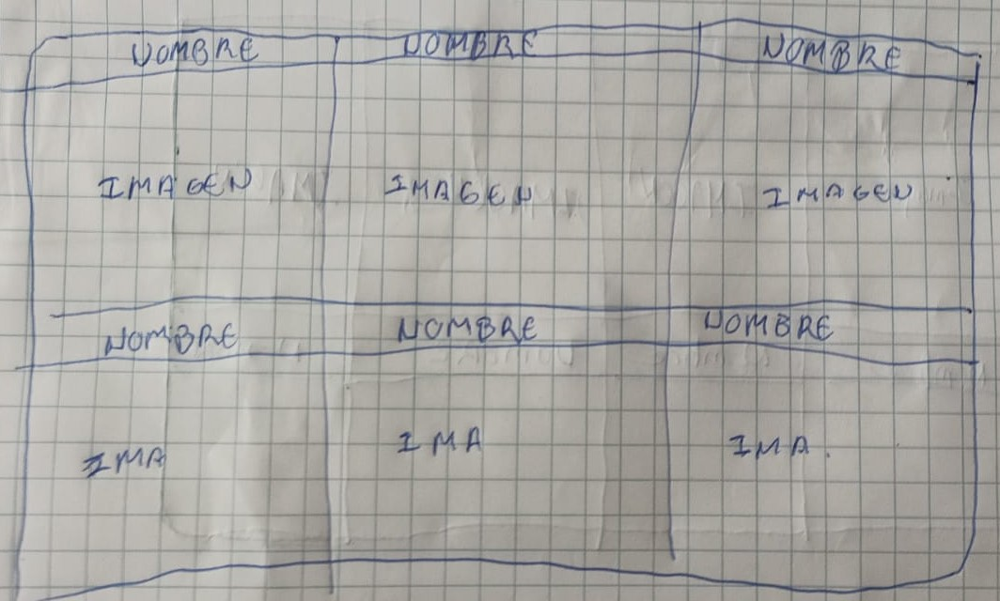
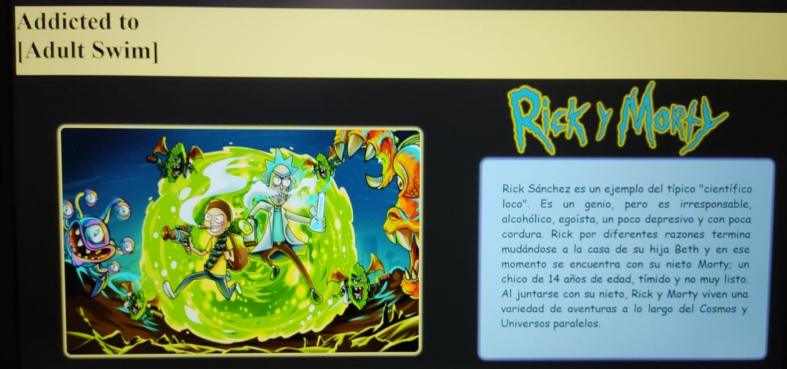
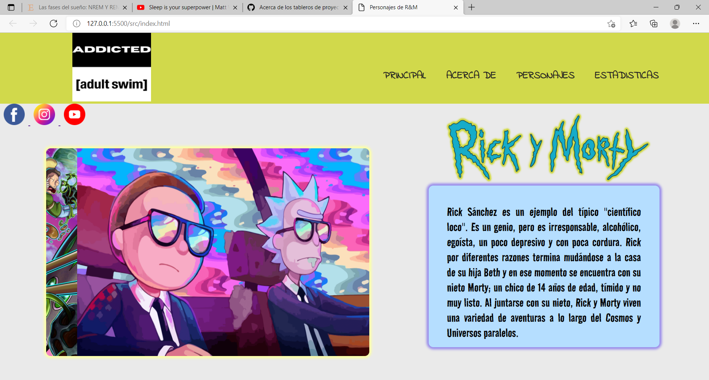

# ADICTED TO ADULT SWIM: Rick and Morty

## Índice

* [1. Introducción](#1-introducción)
* [2. Enfoque del proyecto](#2-enfoque-del-proyecto)
* [3. Entendiendo al usuario](#3-entendiendo-al-usuario)
* [4. Resolviendo la problemática](#4-resolviendo-la-problemática)
* [5. Proceso de diseño](#5-proceso-de-diseño)
* [6. Tests de usabilidad](#6-tests-de-usabilidad)

***

## 1. Introducción

"Rick and Morty" es una serie de televisión estadounidense de animación para adultos creada por Justin Roiland (Pecezuelos, Gravity Falls, etc.) y Dan Harmon (Community, Monster House, etc.) para Adult Swim.  Es transmitida por la aplicación web y la app de Adult Swim, su página web, HBO Max, Netflix y Hulu.  La serie tiene su origen en un corto animado de Roiland, inicialmente llamado "Doc and Mharti", que era una parodia de lo personajes de "Back to the Future".

Todo inicia cuando el genio, irresponsable y algo depresivo Rick se muda a casa de hija y madre de Morty.  Morty en ese momento es un chico tímido, muy nervioso y con una fuerte moral.  A través de sus aventuras espaciales, temporales e intergalácticas, la intención de Rick es hacer de Morty una persona distinta a su padre Jerry, un hombre sin ambiciones e inútil por lo que depende mucho de Beth.  En algunas ocasiones Summer, la hermana de Morty, participa de sus aventuras.

Actualmente cuenta con 5 temporadas, 51 episodios y un especial.  Se estima que la temporada 6 será estrenada en el 2022.

## 2. Enfoque del proyecto

Al ser una serie creada para Adult Swim, cuyo público objetivo son adolescentes y adultos jóvenes varones entre las edades de 18-34, los programas en general contienen violencia gráfica, lenguaje fuerte, humor negro y situaciones surrealistas.

Este público busca información en la web y gustan de los sitios interactivos, pero con una cantidad de texto reducida o de fácil lectura.  De esta forma el sitio debe tener opciones claras que no conlleven a errores o contenido no deseado y también tener una visualización armoniosa con el tema.

## 3. Entendiendo al usuario

Según los seguidores de la serie los datos más relevantes son los personajes y sus biografías (una imagen del personaje, nombre, estado de vida, género, especie y lugar de origen) y el número de episodios.
Debido al tipo de público al que va dirigido, el sitio debe tener información directa, ser interactivo, contar con toda la información relevante y ser responsive.
Es decir, los usuarios de este sitio necesitan:

a. Una página con información centralizada sobre los personajes, con la opción de filtrarla u ordenarla como deseen

b. Una interfaz interactiva y amigable

c. Ser responsive en smartphones, desktops y tablets

## 4. Resolviendo la problemática

En este proyecto crearemos un APIcon la data procurada en el repositorio, en este caso, usando el archivo .json.  Las páginas del proyecto contarán con la estructura básica de un header, section y footer.  Para lograr nuestro objetivo cumpliremos con las siguiente historias de usuario:

#### a. Una página con información centralizada sobre los personajes, con la opción de filtrarla u ordenarla como deseen

* La página debe tener una estructura básica de header, section y footer
* El header debe tener el logo
*	El footer debe tener íconos de redes sociales
*	La página inicia con una breve descripción e imagenes
*	Los personajes se muestran en cards con su imagen, nombre y su información de perfil
*	En la segunda vista se muestra una barra con selects y sus respectivos options para escoger como queremos filtrar en cuanto a  género, especie y estado.
*	En la misma barra debe haber un select para ordenar los resultados por relevancia del personaje, A-Z o Z-A
*	Al lado debe haber un botón para aplicar los filtros y orden, y otro botón para limpiar los datos de búsqueda
*	La página debe regresar a la página principal o puede escoger la página de estadisticas

**Definición de terminado:** la página inicia con todos los personajes, debe filtrar y ordenar los personaje según la elección del usuario y mostrar lo seleccionado.

#### b. Una interfaz interactiva y amigable

*	El logo de la página debe tener un tamaño, color y forma que lo distinga
*	La imagen del header no debe opacar al logo
*	La barra de filtrado y ordenado debe tener selects de un color de la paleta y una fuente que la caracterize
*	Las cards tienen una imagen (con tamaño suficiente para visualizar a los personajes) y su nombre
*	Las cards muestran su información de perfil

**Definición de terminado:** la página debe ser fácil de utilizar, las cards deben mostrar la información debe ser fácil de visualizar

#### c. Ser responsive en smartphones, desktops y tablets

*	Mostrar tarjetas más pequeñas
*	Que el menú desplegable se mantenga en la parte superior (menú barra)
*	Las funcionalidades de la página se deben mantener en cualquier dispositivo
*	Rediseñar para adaptarlo a teléfonos, tablets,etc

**Definición de terminado:** la página debe ser visible y navegable desde una desktop, un celular o una tablet

## 5. Proceso de diseño

**Prototipos de papel**

**Prototipos de alta fidelidad**

**Prototipo final**

## 6. Tests de usabilidad

A medida que fuimos desarrollando el sitio surgieron algunos cambios de diseño para mejor lectura, accesibilidad y orden. Como por ejemplo:

*	Cambiar el cursor por pointer al pasar por los botones de navegación
*	Hacer la descripción del sitio más corta
* incluir menu en barra para pantallas pequeñas(menú barra)
* Poder filtrar por género, estado de vida y especie
* Cambiar fuentes de los labels

